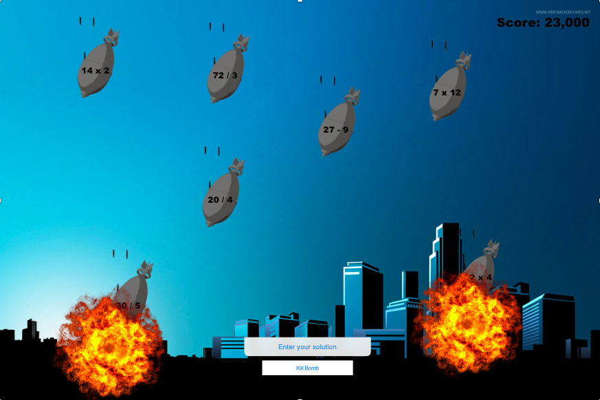

## Overview

Bombdrops is a simple and educational game that trains your arithmetic skills by solving math problems before the bombs hit the city (ground). As the game begins and player enters a username, bombs will start falling from the sky and the player will have to solve the math problem on each falling bomb before it destroys the city. As the third falling bomb hits the city, the city will be entirely vanished, which also means it is game over for the player.  

Speaking of the falling speed of the bombs, the falling speed will increase by 0.25 second as player gains every 1,000 points (each bomb counts 100 points). There will also be a golden bomb with a harder math problem that can explode all other falling bombs in the sky at the same time. This golden bomb will appear every 20 seconds/1,500 points. As game ends, the interface will display a score board with player's performance info and a ranking board with the scores of the top 10 players. 

This app is inspired by a mobile app, Lumosity, (https://www.lumosity.com/). I am envisioning a design with white and blue as theme colors and excitement and user-friendliness as missions.

### Functionality

* Users can enter the solution to the math problem.
* The bombs will be generated from the top of the screen and fall with various speeds.
* The golden bomb can kill all other falling bombs.
* The game ends if a third bomb hits to the ground.
* The score of each round will be recorded and saved to a localStorage. A ranking board with the scores of the top 10 players.

### Wireframes

The app will consist of a single page with a play button, an input box for username, an input box for solution, a solution submit button, and the links to the Github repository and developer LinkedIn.

Upon pressing the Play button, the game renders a window with the instructions of the game. As player quits out the window, game will offically start.

Upon 'Game Over' a scoreboard modal will appear with a highlighted score of yours and a score list of the top 10 players.

##### Technologies employed

* Vanilla JavaScript for game logic.
* HTML5 Canvas for rendering.
* Howler.js (or HTML audio player) for game background music.
* Webpack to bundle various scripts into a single source.
* React.js for basic page structure and functionality.

##### Main files
* `bombdrops.js` main structure of the canvas and center of game logic.
* `board.js` responsible for rendering ranking board.
* `player.js` receives input and sends outputs.
* `obstacle.js` handles individual falling bomb.
* `scoreboard.jsx` fetches scores and displays them in a `<ul></ul>`.

### MVPs
- [x] Basic visuals and an interactive interface.
- [x] Player can enter solution to the problem
- [x] Falling bombs generate and fall toward the ground with different speeds
- [x] Falling bombs leads to game over upon the third hitting the ground
- [x] Window styling ranking board modal.

### Development timeline

##### Jan 9, Wed, day 1:
- [x] Finish brainstorming, concept, and proposal.

##### Jan 10, Thur, day 2:
- [x] Finish basic project skeleton and essentials.
- [x] Briefly review web app using canvas from the instructional curriculum.

##### Jan 11, Fri, day 3:
- [x] Complete basic page skeleton and functionality.
- [x] Know how to manipulate localStorage.
- [x] Complete ranking board design and rendering.

##### Jan 12, Sat, day 4:
- [x] Complete user input design and rendering.
- [x] Start falling bombs rendering and functionality.

##### Jan 13, Sun, day 5:
- [x] Ideally finish falling bombs rendering and functionality.
- [x] Implement falling bombs hitting to the ground (game over).

##### Jan 14, Mon, day 6:
- [x] Finish game over condition.
- [x] Ranking board rendering.

##### Jan 15, Tue, day 7:
- [x] Finish styling page.
- [x] Complete MVPs and iron out project.

##### Jan 16, Wed, day 8:
- [x] Implement bonus features.

### Bonus features
- [x] Adjustable falling speed
- [x] Render falling bombs with coding problems instead of all with math problems